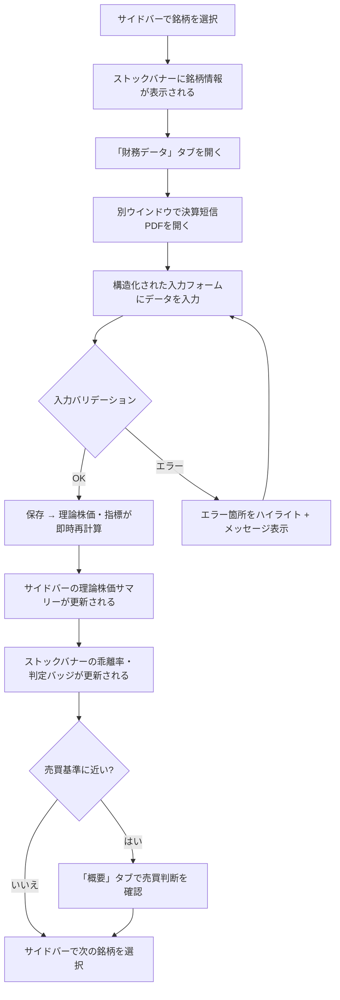
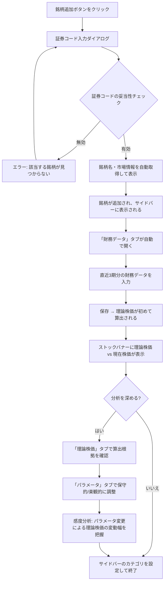
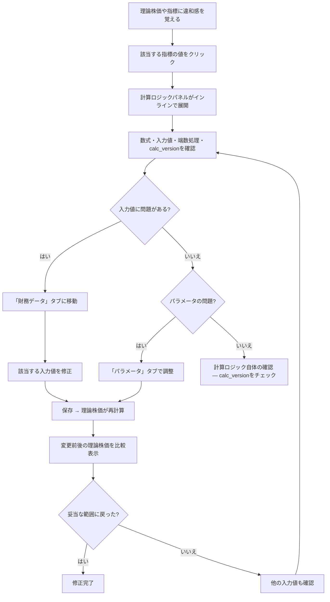

# UX Design Specification StockManagement

**Author:** Fujita_kenshirou
**Date:** 2026-03-03

---

<!-- UX design content will be appended sequentially through collaborative workflow steps -->

## Executive Summary

### Project Vision

StockManagement は、企業価値評価理論に基づく理論株価算出を中核とした、中長期保有志向の個人投資家向け財務分析Webアプリケーションである。「透明性の原則」を設計思想の柱に据え、計算ロジック・データ判定・前提パラメータをすべて開示することで、投資家が「なぜその数字になったか」を理解しながら投資判断を行える環境を提供する。

UXの観点では、以下の二段構造の意思決定フローを支えるUIが求められる：
- **銘柄算定**: フィルタリング → 定量分析（理論株価算出）→ 定性分析 → ロースター決定
- **売買タイミング**: ロースター銘柄の理論株価・購入基準（理論株価の半額）・売却基準（理論株価の1.5倍）の一覧把握 → 基準到達時のプッシュ通知 → 企業レベルの重大変化に対するレポート通知

### Target Users

**プライマリユーザー（Phase 1 = 開発者自身）:**
- 30代会社員、投資歴5年。理論ベースの分析をスプレッドシートで自力実践中
- 自宅 iMac（大画面デスクトップ）で利用
- 決算シーズンに集中しつつ、平時も定期的に利用（優先度の低い銘柄の入力、新規銘柄の発掘）
- 性格的に「やるとなったら一気にやる」集中セッション型
- 最大のペイン: ロースター変更時のシート間参照の複雑さ、決算資料の単位混在（百万円/千円/円）によるコピペミス

**セカンダリユーザー（OSS公開後）:**
- 投資に興味はあるが自信のない初中級者。理論の存在を知らない、または知っているが実践方法がわからない

### Key Design Challenges

1. **データ密度の管理**: 1銘柄あたり20以上の指標 × 複数期 × 50銘柄以上。情報過多を避けつつ必要な数値に即アクセスできるUI設計
2. **単位変換の煩雑さ**: 決算資料ごとに異なる単位（百万円/千円/円）の混在。入力時の誤りを減らす仕組み
3. **ロースター変更の複雑さ**: 現状スプレッドシートで最大のペイン。分類変更がシンプルな操作で完結する設計
4. **長時間集中セッションへの対応**: まとまった時間で一気に作業するスタイルに合った、疲労しにくいレイアウトとナビゲーション
5. **透明性と使いやすさの両立**: 計算ロジックを完全開示しつつ、普段の操作では邪魔にならないバランス

### Design Opportunities

1. **スプレッドシートの構造的弱点の解消**: 参照範囲の複雑さ・シート間移動の手間を、DB駆動のUIで根本解決。ロースター変更はドラッグ＆ドロップまたはワンクリック操作に
2. **プログレッシブ・ディスクロージャー**: 一覧→詳細→計算ロジックの段階的な情報深度。必要な時に必要な情報だけ表示
3. **アクションドリブンなダッシュボード**: 「今、何を判断すべきか」が一目でわかるUI。購入基準・売却基準に近い銘柄のハイライト、基準到達時のプッシュ通知
4. **iMac 大画面の活用**: 広い画面を活かした分割ビュー（決算資料参照しながらのデータ入力、銘柄間の横並び比較）

## Core User Experience

### Defining Experience

**最頻繁なユーザーアクション: 銘柄探し（スクリーニング + 深掘り分析）**

StockManagement のコア体験は「自分の投資基準に合う銘柄を見つけること」である。売買タイミングの判断は四半期決算や外部ショック時に限定されるのに対し、銘柄探しは平時も含めて最も多くの時間が費やされる活動となる。

定量条件（移動平均ROICが3年連続15%以上、FCFが安定して基準内、等）と定性条件（事業の競争優位性、経営者の言行一致度）の両面で、ユーザー独自のフィルタを通して候補を絞り込み、深掘りしていく体験をシームレスに設計する。

**絶対に完璧にすべきインタラクション: 理論株価の透明な閲覧**

計算結果の「なぜその数字になったか」を追跡できることが、本プロダクトの存在意義そのもの。数式・入力参照・端数処理・calc_version を含む計算過程の閲覧体験は、他のどの機能よりも優先してUXを磨く。

### Platform Strategy

- **プラットフォーム**: Web（Next.js SPA）。デスクトップファースト
- **主要デバイス**: iMac（大画面）。マウス＋キーボード操作が基本
- **オフライン**: 不要。常時オンライン前提
- **通知**: プッシュ通知が必要（売買基準到達、スクリーニング条件合致）。Web Push Notification またはメール通知で実現
- **大画面活用**: 分割ビュー（決算資料参照しながらの入力、銘柄間比較）を積極的に活かす

### Effortless Interactions

以下のインタラクションは、ユーザーが意識せず自動的に行われるべきである：

1. **パラメータ変更 → 即時再計算**: r / g / 実効税率等を変更した瞬間に、理論株価と全関連指標が自動更新される
2. **決算データの自動取得**: EDINET等からの取得が完了すると、理論株価が自動更新される。単位（百万円/千円/円）や決算期の表記は、元データが何を意味しているか直感的にわかる形で表示する
3. **売買条件の監視 → プッシュ通知**: ユーザーが設定した購入基準（理論株価の半額）/ 売却基準（理論株価の1.5倍）に到達したら自動で通知
4. **スクリーニング条件の常時監視 → 通知**: ユーザーが設定した定量条件（例: 移動平均ROIC 3年連続15%以上 + FCF安定）に合致する新たな銘柄が見つかったら通知

### Critical Success Moments

1. **「これだ」の瞬間（最重要）**: 決算データが自動取得され、手入力なしで理論株価が更新されている。これが「スプレッドシートより良い」と実感する最初で最大の瞬間
2. **透明性の勝利**: 理論株価に違和感を覚えた時、計算ロジックを辿って原因（入力値の誤り、パラメータの設定ミス等）を自力で特定・修正できる
3. **発見の喜び**: スクリーニング条件に合致する未知の銘柄が通知され、深掘り分析の結果「いい会社だ」と確信が持てた時
4. **判断の自信**: 理論株価と市場価格のギャップを見て、定量・定性の根拠を持って「今が買い時だ」と判断できた時

### Experience Principles

1. **透明性ファースト**: 計算結果の透明性が最優先のUX価値。理論株価の「なぜ」を、いつでも・どの指標からでも追跡できる
2. **手作業の撲滅**: データ取得→計算→通知の一連のフローを可能な限り自動化し、ユーザーの時間を「判断」に集中させる
3. **発見を支援するUI**: 銘柄探しが最頻繁な活動。フィルタリングと深掘りの行き来がシームレスで、条件に合う銘柄を能動的にも受動的（通知）にも発見できる
4. **待たせない即時性**: パラメータ変更→再計算→表示の反映が即座。ユーザーの思考を中断しない応答速度

## Desired Emotional Response

### Primary Emotional Goals

**自信と楽しさの両立**

- **根拠ある自信**: 「数値的なデータと事業内容の両面から分析して、自分にとってのいい会社に、適切な金額で投資できている」という確信
- **ノイズからの解放**: 短期的な株価変動、ニュース、"美味しい投資のコツ"的な情報に振り回されず、理屈に基づいて冷静でいられる安心感
- **理屈がわかる楽しさ**: 「ちゃんと理屈がわかって行う株式投資って楽しい」という知的好奇心の充足

### Emotional Journey Mapping

| フェーズ | 目指す感情 | 避けたい感情 |
|---------|-----------|-------------|
| **初回利用** | 「まずこれをやればいいんだな」という明快さ | 何から始めればいいかわからない混乱 |
| **データ入力 / 取得** | 手間がない安堵。データの出自が明確な信頼感 | 公式資料とシステムのデータが合わない不信 |
| **計算結果の閲覧** | 数字の根拠が全部見える安心。「なるほど」の納得 | 数値の根拠がわからないブラックボックス感 |
| **想定外の結果** | 「自分のパラメータ設定かな？」とまず自分を疑える信頼 | システムのバグを疑う不安 |
| **銘柄探し** | 条件に合う企業を見つけた時の発見の喜び | フィルタの使い方がわからない苛立ち |
| **売買判断** | 定量＋定性の根拠を持って判断できる自信 | 「本当にこれでいいのか」という逡巡 |
| **友人に勧める時** | 「勉強は必要だけど、理屈がわかると気が楽」という実感 | — |

### Micro-Emotions

**最重要: Trust（信頼）> Skepticism（懐疑）**
- すべての数値がその根拠まで追跡可能であること。公式開示情報（EDINET、決算短信等）→入力値→計算結果のデータリネージが常に確認できる状態が信頼の基盤
- 想定外の結果が出た時、ユーザーが「システムではなく自分の設定を疑う」レベルの信頼を構築する

**重要: Confidence（確信）> Confusion（混乱）**
- 画面を開いた時、次に何をすべきかが自明であること
- 情報密度が高い画面でも、視線の導線と階層が明確で迷わない

**支援: Joy（楽しさ）> Tedium（退屈）**
- データ入力の自動化により、「作業」から「分析」に時間の使い方が変わる
- 銘柄探しが宝探しのような楽しさを持つ

### Design Implications

| 感情目標 | UXデザインへの反映 |
|---------|------------------|
| **数値への信頼** | すべての指標にデータソース（EDINET / 手動入力 / 算出値）を明示。公式資料との照合が容易な表示 |
| **初回の明快さ** | オンボーディングフローで「最初の1銘柄を登録→データ入力→理論株価を見る」までを明確にガイド |
| **想定外への冷静さ** | 計算結果の変動が大きい場合、「変動要因の候補」を自動表示（例: 「有利子負債が前期比+200%」） |
| **ノイズからの解放** | ダッシュボードに短期ニュースや日次株価チャートを置かない。中長期分析に集中させるUI |
| **発見の楽しさ** | スクリーニング結果に「なぜこの銘柄が条件に合致したか」の理由を表示 |

### Emotional Design Principles

1. **データリネージの可視化**: すべての数値に「どこから来たか」のトレーサビリティを持たせる。これが信頼の基盤であり、最も重要な感情設計の柱
2. **最初の一歩を明確に**: 初回利用時に「何をすればいいかわからない」は致命的。オンボーディングで迷わせない
3. **中長期思考を守るUI**: 短期ノイズ（日次株価変動、ニュース速報等）を排除し、理論に基づく冷静な判断を支える画面構成
4. **学習コストを認めた上での誠実さ**: 「使いこなすには株の勉強が必要」という事実を隠さず、学びと分析の楽しさを体験に組み込む

## UX Pattern Analysis & Inspiration

### Inspiring Products Analysis

**バフェットコード（参考 — シンプルさの方向性）**
- 良い点: 画面がすっきりしていて迷わない。銘柄を選んで指標を見る、という基本動線が明快
- 課題: 機能がシンプルすぎて「もっとできてほしい」。理論株価算出やパラメータ調整のような深い分析ができない
- 学び: **基本動線のシンプルさは維持しつつ、深い機能は階層で隠す**

**カブタン / 株探（反面教師 — 情報過多）**
- 良い点: 情報量が豊富で、探せば大抵のデータは見つかる
- 課題: 画面がごちゃつき、遷移がわかりづらい。何をすればどう動くかが直感的でない
- 学び: **情報量を増やしても動線の明快さを犠牲にしない**

**ユーザーの好み（横断的に）**
- シンプルさが好き。装飾や機能の詰め込みより、動線のわかりやすさを重視
- 「何をすればどう動くか」が一目でわかることが最重要
- 機能の豊富さよりも操作の予測可能性を優先

### Transferable UX Patterns

**ナビゲーションパターン:**
- **一覧→詳細のドリルダウン**: 銘柄一覧から個別銘柄への遷移はシンプルな1クリック。バフェットコード的な直感性を維持
- **サイドバー＋メインコンテンツ**: 左にナビゲーション、右にコンテンツ。現在地が常に明確な構造

**情報階層パターン:**
- **プログレッシブ・ディスクロージャー**: 一覧では最重要指標のみ表示。詳細は展開/遷移で。カブタンの「全部見せる」の逆を行く
- **コンテキスト内の深掘り**: 指標をクリック/ホバーすると計算ロジックが表示される。画面遷移なしで透明性を確保

**インタラクションパターン:**
- **予測可能な操作**: すべてのクリッカブル要素が視覚的に明示。「何をすればどう動くか」が自明
- **即時フィードバック**: パラメータ変更→再計算が画面遷移なしで即座に反映。操作と結果の因果関係が明確

### Anti-Patterns to Avoid

1. **情報の詰め込み（カブタン型）**: 1画面に全指標を並べない。ユーザーが「今必要な情報」だけ見える設計にする
2. **隠れた遷移**: クリックしないと次のアクションがわからないUI。ナビゲーションと可能な操作は常に可視
3. **モーダル地獄**: 計算ロジックの閲覧をモーダルの連鎖にしない。インラインまたはパネル展開で文脈を保つ
4. **装飾的なアニメーション**: 集中セッション型のユーザーにとって、過剰なアニメーションは邪魔。遷移は最小限で高速に
5. **短期ノイズの混入**: 日次チャート、ニュースティッカー、広告バナー等を配置しない。中長期分析の集中を守る

### Design Inspiration Strategy

**採用する方向性:**
- バフェットコード的な「銘柄選択→指標表示」の基本動線のシンプルさ
- 1画面1目的の明確な画面設計
- 操作の予測可能性（何をすれば何が起きるかが自明）

**独自に発展させる方向性:**
- バフェットコードにない深い分析機能（理論株価、パラメータ調整、スクリーニング）を、プログレッシブ・ディスクロージャーで階層的に追加
- 透明性の閲覧をインラインで実現（画面遷移やモーダルに頼らない）
- フィルタリングと深掘りの行き来をシームレスに

**避ける方向性:**
- カブタン的な情報の全方位表示
- 遷移が予測できないごちゃついたUI
- 装飾・アニメーション過多

## Design System Foundation

### Design System Choice

**shadcn/ui + Tailwind CSS**

Radix UI をベースとしたコピー＆ペースト型のコンポーネントコレクションと、ユーティリティファーストの CSS フレームワークを組み合わせて使用する。

### Rationale for Selection

1. **アクセシビリティの基盤**: Radix UI が WAI-ARIA パターンを実装済み。WCAG 2.1 Level AA（NFR10-15）の達成を効率化できる
2. **完全なコントロール**: ライブラリ依存ではなく自分のコードとして取り込むため、すべてのコンポーネントを自由にカスタマイズ可能
3. **Next.js との親和性**: Next.js エコシステムで最も広く採用されている組み合わせ。App Router、Server Components との互換性が高い
4. **1人開発に最適な軽量さ**: MUI や Ant Design と比較して導入・学習コストが低く、バンドルサイズも小さい
5. **シンプルなUI実現**: Tailwind のユーティリティクラスでスタイリングが明示的。「バフェットコード的シンプルさ」を実現しやすい
6. **コスト**: 完全無料・OSS

### Implementation Approach

- **Phase 1**: shadcn/ui の標準コンポーネント（Table, Form, Dialog, Sheet, Tabs, Card 等）をベースに構築
- **カスタムコンポーネント**: 理論株価の透明性閲覧パネル、パラメータ調整スライダー、ロースター管理ボード等はプロジェクト固有のコンポーネントとして開発
- **テーマ**: CSS 変数ベースのテーマシステムで、ダークモード対応も将来的に可能

### Customization Strategy

- **デザイントークン**: Tailwind の設定ファイルでカラーパレット、スペーシング、タイポグラフィを一元管理
- **コンポーネントの拡張**: shadcn/ui のコンポーネントを必要に応じて拡張・修正。依存ライブラリのアップデートに振り回されない
- **データ表示特化**: 財務データのテーブル表示、指標のカード表示、計算ロジックのインライン展開など、本プロジェクト特有のパターンをコンポーネントライブラリとして蓄積

## Defining Core Experience

### Defining Experience

**「数字をクリックすれば、その根拠がわかる」**

StockManagement を友人に説明するなら：「銘柄の理論株価を出してくれて、どの数字も"なぜそうなったか"がクリックひとつでわかるツール」。

この体験が、既存の有料ツール（結果だけ見せるブラックボックス）やスプレッドシート（参照元を辿るのが面倒）との決定的な差別化になる。

### User Mental Model

**スプレッドシートのメンタルモデルからの移行**

ユーザーの現在の体験：
- セルをクリック → 数式バーで計算式を確認 → 参照元セルに目視で移動
- 良い点: 計算式が明確に見える。自分で作ったから構造を理解している
- 辛い点: 参照元を辿るのが面倒。シートをまたぐと迷子になる

StockManagement が提供するメンタルモデル：
- 指標をクリック/ホバー → 計算式と入力値がインラインで即表示
- 参照元へのジャンプは不要。必要な情報がその場で完結する
- スプレッドシートの「透明性」を維持しつつ、「参照の面倒さ」を解消

### Success Criteria

コア体験が成功している状態：
1. **即座に根拠が見える**: 任意の指標をクリック/ホバーして1秒以内に計算式・入力値・端数処理ルールが表示される
2. **参照元を辿る必要がない**: 計算に使われた入力値（期、単位付き）がすべてその場で表示され、別画面に飛ばなくてよい
3. **コンテキストに応じた次のアクション**:
   - 保有株を見ている → 理論株価 vs 現在株価の比較から売買判断に自然に移行できる
   - 銘柄選定中 → 他の候補銘柄との比較ビューに切り替えられる
   - パラメータを調整したい → その場でスライダー/入力で変更、即再計算
4. **自分で作ったのと同じ信頼**: スプレッドシートで自分が組んだ数式と同じレベルの明示性があり、「中身がわかっている」安心感がある

### Novel UX Patterns

**既存パターンの組み合わせ + 透明性のユニークな実装**

- **既存パターンの活用**: 一覧→詳細のドリルダウン、ホバーでのツールチップ、インラインでの展開 — いずれもユーザーが学習済みのパターン
- **本プロダクト固有の革新**: 指標の透明性閲覧を「計算ロジックパネル」としてインライン展開する体験。スプレッドシートの数式バーに相当するが、参照元の値も含めてその場で完結する
- **教育不要**: 「数字をクリックすれば根拠が見える」は直感的で、新しい操作を学ぶ必要がない

### Experience Mechanics

**コア体験の詳細フロー:**

**1. 開始（Initiation）:**
- 銘柄詳細画面で、各指標の値がクリッカブルであることが視覚的に示されている（例: 下線、アイコン、ホバー時のハイライト）
- ユーザーが気になる指標の値をクリックまたはホバーする

**2. インタラクション（Interaction）:**
- クリック: 指標の下にインラインで「計算ロジックパネル」が展開される
  - 数式（文字列表現）
  - 使用した入力値（期・連結/単体・単位付き）
  - 端数処理ルール
  - calc_version
- パネル内でパラメータ（r, g, 実効税率）が直接調整可能 → 変更すると関連指標が即座に再計算される

**3. フィードバック（Feedback）:**
- パラメータ変更時: 影響を受ける指標がハイライトされ、変更前後の値が比較表示される
- 正常状態: 計算式と入力値が一致していることが視覚的に確認できる
- 異常検出: 前期比で大幅な変動がある入力値には警告マーク

**4. 次のアクション（Completion → Transition）:**
- パネルを閉じて他の指標を確認
- 「比較」ボタンで他の銘柄との横並び比較に遷移
- 「売買判断」エリアで理論株価 vs 市場価格のギャップを確認
- パラメータ調整に満足したら、銘柄一覧に戻る

## Visual Design Foundation

### Color System

**方向性: スッキリ × リラックス × 楽しさ**

- **ベースカラー**: ライトグレー〜ホワイト系の明るい背景。長時間の集中セッションでも目が疲れにくい
- **プライマリカラー**: ティール〜ソフトブルーグリーン系。信頼感がありつつ、重たくならない爽やかさ
- **アクセントカラー**: 暖色系のアクセント（アンバー / コーラル系）で「楽しさ」を演出。スクリーニングのヒットや発見の瞬間に使用
- **セマンティックカラー**:
  - Success（緑）: 買い基準到達、条件合致
  - Warning（アンバー）: 前期比大幅変動、パラメータ注意
  - Error（赤）: データ不整合、入力エラー
  - Info（ブルー）: 計算ロジックパネル、ツールチップ
- **コントラスト**: WCAG 2.1 Level AA 準拠。テキスト最低 4.5:1、大文字 3:1 を確保
- **ダークモード**: Phase 1 では対応しない。CSS変数ベースで将来的に追加可能な設計にしておく

### Typography System

**方向性: ヒューマニスト・フレンドリー**

- **欧文フォント**: Source Sans 3 — 手書きの温かみが残りつつ数字の視認性も高い。GitHub / Stripe 的な親しみやすさ
- **和文フォント**: Noto Sans JP — Source Sans 3 と字幅・ウェイトの相性が良い。Google Fonts で無料利用可能
- **フォールバック**: system-ui, sans-serif
- **タイプスケール（rem / 16px基準）**:
  - h1: 1.875rem (30px) — ページタイトル
  - h2: 1.5rem (24px) — セクション見出し
  - h3: 1.25rem (20px) — カード見出し、銘柄名
  - body: 1rem (16px) — 本文、説明テキスト
  - data: 0.875rem (14px) — テーブル内の数値、指標
  - caption: 0.75rem (12px) — 補足情報、calc_version、データソース表示
- **行間**: body 1.6、data 1.4、見出し 1.3
- **数値表示**: tabular-nums（等幅数字）を指定し、テーブル内の数値が縦に揃うようにする

### Spacing & Layout Foundation

**方向性: 余白多めでゆったり**

- **ベースユニット**: 8px（Tailwind デフォルト互換）
- **スペーシングスケール**: 4 / 8 / 12 / 16 / 24 / 32 / 48 / 64 px
- **コンポーネント間余白**: 24px（3ユニット）を基本に、セクション間は 48px
- **カード内パディング**: 24px。データテーブルのセルは 12px × 16px
- **レイアウト構造**: サイドバー（240px固定）＋メインコンテンツ（フルード）
- **グリッド**: メインコンテンツ内は 12カラムグリッド。ダッシュボードのカード配置に使用
- **最大コンテンツ幅**: 1280px（iMac の広い画面でもコンテンツが横に広がりすぎない）
- **レイアウト原則**:
  1. 余白で情報のグルーピングを表現する（罫線よりもスペースで区切る）
  2. 1画面1目的。スクロールは許容するが、主要アクションはファーストビューに収める
  3. 計算ロジックパネルの展開時、周囲のコンテンツを押し下げる（オーバーレイしない）

### Accessibility Considerations

- **カラーコントラスト**: WCAG 2.1 Level AA（4.5:1 / 3:1）を全テキスト・UI要素で確保
- **フォントサイズ下限**: 12px（caption）。それ以下は使用しない
- **色だけに依存しない情報伝達**: Success / Warning / Error はアイコン＋テキストラベルを併用
- **フォーカス表示**: すべてのインタラクティブ要素に明確なフォーカスリングを表示
- **キーボード操作**: Tab でのナビゲーション、Enter / Space での操作、Escape でのパネル閉じ

## Design Direction Decision

### Design Directions Explored

5つのデザインディレクションを HTMLモックアップ（`ux-design-directions.html`）で比較検討した：

1. **カードダッシュボード型** — KPIカード + カテゴリ別メトリクスカード。概要把握向き
2. **スプリットビュー型** — 左に銘柄リスト、右に詳細。銘柄切替が高速
3. **ノートブック型** — 1カラム縦スクロール。レポート的な閲覧体験
4. **タブ整理型** — ヘッダー固定 + タブでカテゴリ切替。1カテゴリずつ集中
5. **ハイブリッド型** — KPI概要 + テーブル + アクションパネルを1画面に統合

### Chosen Direction

**タブ整理型ベース + サイドバー理論株価サマリー**

Direction 4（タブ整理型）をベースに、サイドバー下部に選択中銘柄の理論株価サマリーを常時表示するカスタム構成を採用する。

**レイアウト構造：**

- **左サイドバー（240px固定）**:
  - 上部: グローバルナビゲーション（ダッシュボード、スクリーニング、ロースター等）
  - 中部: ロースター銘柄リスト（コア銘柄、検討中等のカテゴリ分け）
  - 下部: 選択中銘柄の理論株価サマリー（結論の金額、計算数式の概要、データソース、calc_version）
- **右メインエリア**:
  - ストックバナー（固定）: 銘柄名、証券コード、理論株価、現在株価、乖離率、判定バッジ
  - タブナビゲーション: 概要 / 理論株価 / 財務データ / パラメータ等
  - タブコンテンツ: 各カテゴリの詳細情報。パラメータ調整スライダーは「パラメータ」タブ内に配置

### Design Rationale

1. **「1画面1目的」との整合**: タブで分析カテゴリを切り替えることで、情報過多を避けつつ必要な深さの分析が可能
2. **透明性の常時表示**: サイドバー下部に理論株価の算出根拠サマリーが常にあるため、どのタブを見ていても「今の理論株価がなぜその金額なのか」が視界に入る
3. **ストックバナー固定の安心感**: 銘柄名・理論株価・現在株価・乖離率が常にヘッダーに表示されるため、文脈を見失わない
4. **ユーザーの好み**: シンプルで予測可能な操作性。タブの切り替えは直感的で学習コストが低い
5. **スプレッドシートからの移行**: シートのタブ切り替えに相当する操作感で、既存のメンタルモデルと親和性が高い

### Implementation Approach

- **サイドバー**: shadcn/ui の NavigationMenu + カスタムの理論株価サマリーコンポーネント
- **ストックバナー**: sticky 配置でスクロールしても固定。shadcn/ui の Card ベース
- **タブ**: shadcn/ui の Tabs コンポーネント。URL パラメータと連動させ、タブ状態を保持
- **理論株価サマリー（サイドバー）**: 選択銘柄が変わると自動更新。数式はコンパクトな1行表示、詳細は「理論株価」タブで確認する導線
- **レスポンシブ**: デスクトップファーストだが、サイドバーは折りたたみ可能（ハンバーガーメニュー）にしておき、将来のタブレット対応に備える

## User Journey Flows

### Journey 1: 決算シーズン — 保有銘柄の一斉アップデート

**エントリーポイント:** サイドバーのロースター銘柄リストから、決算データ未更新の銘柄を選択

**Phase 1 フロー:**

**操作の流れ:**
1. サイドバーの銘柄リストをクリックして1銘柄ずつ切り替える
2. 「財務データ」タブの入力フォームで、決算短信（別ウインドウ）を見ながらデータ入力
3. 保存すると理論株価が即座に再計算され、ストックバナーとサイドバーに反映
4. 気になる点があれば「概要」「理論株価」タブで確認し、問題なければ次の銘柄へ
5. 1銘柄完了ごとにサイドバーの銘柄に「更新済み」の視覚的フィードバック（チェックマーク等）を表示

**設計のポイント:**
- 1銘柄ずつ完結させることで達成感を積み重ねる
- 入力フォームは構造化されており、決算短信の項目と対応関係が明確
- 単位（百万円/千円/円）の選択肢を明示し、コピペミスを防止

### Journey 2: 新規銘柄の発掘 — スクリーニングから投資判断まで

**エントリーポイント:** サイドバーのナビゲーション → 「銘柄追加」ボタン、またはグローバルナビの「＋」アクション

**Phase 1 フロー:**

**操作の流れ:**
1. 外部（株探等）で見つけた銘柄の証券コードを入力して追加
2. 銘柄名・市場情報が自動取得され、サイドバーに追加される
3. 「財務データ」タブが自動で開き、入力を促す
4. 3期分のデータ入力後に理論株価が算出、現在株価との比較が即座に表示される
5. 必要に応じてパラメータを調整し、割安/割高の判定を確認
6. ロースターのカテゴリ（コア、検討中、候補生等）を設定

### Journey 3: データ不整合への対処

**エントリーポイント:** 計算結果を見て「おかしい」と感じた時（ストックバナーの乖離率や、指標の前期比変動が大きい時）

**Phase 1 フロー:**

**操作の流れ:**
1. ストックバナーや指標表示で違和感に気づく（前期比で大幅変動がある場合は警告マーク表示）
2. 気になる指標をクリック → 計算ロジックパネルが展開
3. 数式と入力値を確認し、問題の所在を特定
4. 入力値の誤りであれば「財務データ」タブで修正、パラメータの問題であれば「パラメータ」タブで調整
5. 修正後に理論株価が再計算され、変更前後の比較で妥当性を確認

**設計のポイント:**
- 前期比で大幅な変動がある入力値には警告マーク（アンバーのバッジ）を自動表示
- 計算ロジックパネルから「財務データ」タブの該当項目へのリンクを提供し、修正までの動線を最短化
- 修正前後の理論株価の差分を明示し、修正の影響を即座に把握できるようにする

### Journey Patterns

3つのジャーニーに共通するパターン：

**ナビゲーションパターン:**
- サイドバー銘柄クリック → メインエリアのタブコンテンツが切り替わる（全ジャーニー共通）
- タブ間の移動で分析のコンテキストを切り替える（財務データ → 理論株価 → パラメータ）

**入力→即時反映パターン:**
- データ入力/パラメータ変更のたびに、理論株価と関連指標がリアルタイムで再計算される
- 変更の影響はストックバナー、サイドバーサマリー、タブコンテンツのすべてに即時反映

**透明性確認パターン:**
- 指標クリック → 計算ロジックパネル展開 → 数式・入力値・出典確認
- どのジャーニーでも、ユーザーは任意のタイミングで「なぜこの数字か」を追跡可能

**フィードバックパターン:**
- 成功: 保存完了 → 指標更新のアニメーション → サイドバー更新済みマーク
- 警告: 前期比大幅変動 → アンバーバッジ + 変動要因の候補表示
- エラー: 入力バリデーション失敗 → エラー箇所ハイライト + 具体的なメッセージ

### Flow Optimization Principles

1. **最短距離の原則**: 銘柄選択→データ入力→結果確認の一連の流れで、不要な画面遷移やモーダルを挟まない
2. **文脈の保持**: サイドバーの理論株価サマリーとストックバナーが常に表示されるため、タブを切り替えても「今どの銘柄の何を見ているか」を見失わない
3. **達成感の可視化**: 1銘柄の入力完了ごとにサイドバーに視覚的フィードバック。決算シーズンの進捗が一目でわかる
4. **エラー回復の近接性**: 問題を発見した場所（計算ロジックパネル）から修正場所（財務データタブの該当項目）への直接リンクを提供

## Component Strategy

### Design System Components

**shadcn/ui から利用するコンポーネント（Phase 1）:**

| コンポーネント | 用途 |
|-------------|------|
| **Tabs** | 銘柄詳細画面のカテゴリ切替（概要/理論株価/財務データ/パラメータ） |
| **Table** | 財務指標の3期分表示、スクリーニング結果一覧 |
| **Card** | KPIカード、メトリクスカード、アクションカード |
| **Form / Input / Select** | 財務データ入力フォーム、銘柄追加ダイアログ |
| **Dialog** | 銘柄追加の証券コード入力、確認ダイアログ |
| **Badge** | 判定バッジ（保有継続/買い検討/割高等）、更新済みマーク、警告マーク |
| **Tooltip** | 指標名の説明、略語の展開 |
| **NavigationMenu** | サイドバーのグローバルナビゲーション |
| **Sheet** | モバイル対応時のサイドバー表示（将来） |
| **Button** | 各種アクション（保存、比較、カテゴリ変更等） |
| **Slider** | パラメータ調整（r, g, 実効税率） |
| **Toast** | 保存完了、再計算完了等のフィードバック |

### Custom Components

#### 1. CalcLogicPanel（計算ロジックパネル）

**Purpose:** 任意の指標の計算根拠をインラインで表示する。本プロダクトのコア体験を担うコンポーネント

**Content:**
- 計算式（文字列表現）
- 使用した入力値（期・連結/単体・単位付き）
- 端数処理ルール
- calc_version
- データソース（EDINET / 手動入力 / 算出値）
- 該当する入力値への「財務データ」タブへの直接リンク

**States:**
- closed: 指標の値のみ表示。下線+ホバーでクリッカブルであることを示す
- open: インラインで展開。周囲のコンテンツを押し下げる
- loading: データ取得中のスケルトン表示

**Accessibility:**
- `role="region"`, `aria-expanded`, `aria-controls` で展開状態を通知
- Escape で閉じる、Enter/Space で開閉トグル

#### 2. StockBanner（ストックバナー）

**Purpose:** 選択中の銘柄の最重要情報を画面上部に常時固定表示する

**Content:**
- 銘柄名、証券コード、市場名
- 理論株価、現在株価、乖離率
- 判定バッジ（保有継続/買い検討/割高等）
- 最終更新日時

**States:**
- default: 通常表示
- updated: データ更新直後にハイライトアニメーション
- warning: 前期比で大幅な変動がある場合にアンバーのボーダー

**Accessibility:**
- `role="banner"` + `aria-label` で現在の銘柄情報を読み上げ
- 理論株価はクリッカブル（CalcLogicPanel を展開）

#### 3. TheoryPriceSummary（理論株価サマリー）

**Purpose:** サイドバー下部に選択中銘柄の理論株価の結論と根拠概要を常時表示する

**Content:**
- 理論株価（金額）
- 計算式の概要（1行サマリー: 事業価値+財産価値−有利子負債÷株式数）
- データソース（EDINET xxxx年x月期）
- calc_version

**States:**
- default: コンパクト表示
- no-data: 財務データ未入力時のプレースホルダー（「データを入力すると理論株価が表示されます」）
- loading: 再計算中のスケルトン

**Accessibility:**
- `aria-live="polite"` で理論株価の変更を自動通知

#### 4. FinancialDataForm（財務データ入力フォーム）

**Purpose:** 決算短信の構造に対応した、構造化された財務データ入力インターフェース

**Content:**
- 期（年度/四半期）の選択
- 連結/単体の選択
- 勘定科目ごとの入力フィールド（売上高、営業利益、当期純利益、総資産、自己資本、有利子負債等）
- 各フィールドに単位選択（百万円/千円/円）

**States:**
- empty: 新規入力。入力を促すガイドテキスト
- editing: 入力中。未保存の変更がある旨を表示
- saved: 保存済み。各フィールドに入力元情報（手動入力 / EDINET）を表示
- error: バリデーションエラー。エラー箇所をハイライト + メッセージ

**Accessibility:**
- 各フィールドに `<label>` を紐付け。エラー時は `aria-describedby` でエラーメッセージを読み上げ
- Tab キーで次のフィールドに移動。Enter で保存

#### 5. ParameterAdjustPanel（パラメータ調整パネル）

**Purpose:** 理論株価算出に使うパラメータ（r, g, 実効税率等）を調整し、結果を即時プレビューする

**Content:**
- パラメータ一覧（割引率 r、成長率 g、実効税率、上限倍率）
- 各パラメータのスライダー + 数値入力
- 変更前後の理論株価の比較表示
- 影響を受ける指標のハイライト

**States:**
- default: 現在のパラメータ値を表示
- adjusting: スライダー操作中。リアルタイムで理論株価が変動
- changed: 変更あり。変更前後の差分を表示。「リセット」ボタン表示
- saved: パラメータ保存済み

**Accessibility:**
- スライダーに `aria-valuemin`, `aria-valuemax`, `aria-valuenow` を設定
- キーボードの矢印キーでスライダー操作

### Component Implementation Strategy

- **ビルド方針**: すべてのカスタムコンポーネントは shadcn/ui のデザイントークン（CSS変数）を使用し、色・スペーシング・タイポグラフィの一貫性を確保する
- **コンポジション**: shadcn/ui の基本コンポーネント（Card, Badge, Tooltip, Button等）を内部で組み合わせてカスタムコンポーネントを構築する
- **テスト**: 各コンポーネントに対してアクセシビリティテスト（axe-core）を実施し、WCAG 2.1 Level AA 準拠を確認する

### Implementation Roadmap

**Phase 1（MVP — コア体験の実現）:**
1. **FinancialDataForm** — Journey 1, 2 の入口。データ入力がなければ何も始まらない
2. **CalcLogicPanel** — コア体験の中核。透明性の実現
3. **StockBanner** — コンテキストの保持。全画面で必要
4. **TheoryPriceSummary** — サイドバーの理論株価表示
5. **ParameterAdjustPanel** — パラメータ調整と感度分析

**Phase 2 以降（拡張）:**
- EDINET 半自動確認 UI（FinancialDataForm の拡張）
- ロースター管理ボード（ドラッグ＆ドロップでカテゴリ変更）
- スクリーニング条件ビルダー
- 銘柄間比較ビュー

## UX Consistency Patterns

### Feedback Patterns

**保存・更新フィードバック:**
- **Toast通知**: 保存成功時に画面右下にToastを3秒間表示。「財務データを保存しました」「パラメータを更新しました」等、操作内容を明示
- **インライン更新**: 理論株価・指標の再計算結果はToastではなく、該当箇所のハイライトアニメーション（tealのフラッシュ、0.3秒）で表示。数値変化を視覚的に追跡できるようにする
- **サイドバーマーク**: 決算シーズンの一斉アップデート時、更新済み銘柄にチェックマークバッジを付与し、進捗を一目で把握可能にする

**エラーフィードバック:**
- **バリデーションエラー**: エラー箇所のボーダーを赤（Error色）に変更 + フィールド直下にエラーメッセージを表示。`aria-describedby` でスクリーンリーダーにも通知
- **システムエラー**: 画面上部にバナー形式で表示。「再試行」ボタンを含め、回復手段を明示
- **接続エラー**: オフライン/タイムアウト時はToast + 自動リトライ（3回まで）+ 手動リトライボタン

**警告フィードバック:**
- **前期比大幅変動**: 入力値が前期比で±30%以上変動した場合、アンバーのバッジ + 「前期比 +45% — 確認してください」のメッセージ。入力は許可するが注意を促す
- **未保存変更**: タブ切替・銘柄切替時に未保存の変更がある場合、確認ダイアログを表示

**情報フィードバック:**
- **ツールチップ**: 指標名・略語のホバーで説明を表示（500msのディレイ後）
- **ガイドテキスト**: 初めての操作・空の状態では、次に何をすればよいかをプレースホルダーテキストで誘導

### Form & Validation Patterns

**ラベルとフィールドの配置:**
- **ラベル位置**: フィールドの上部に配置（Left-aligned top labels）。和文の長いラベルでも折り返しが自然
- **プレースホルダー**: 入力例を薄いグレーで表示。「例: 1,234,567」等、フォーマットの手がかりを提供。ただしラベルの代わりにはしない
- **単位選択**: 金額入力フィールドの右側にドロップダウンで「百万円 / 千円 / 円」を選択可能。デフォルトは前回入力時の単位を保持

**バリデーション:**
- **タイミング**: フィールドからフォーカスが外れた時点（onBlur）で即時バリデーション。送信ボタン押下時にフォーム全体を再チェック
- **成功表示**: バリデーション通過時は控えめなグリーンのチェックマーク（目立たせすぎない）
- **エラー表示**: フィールド直下に赤テキスト + フィールドボーダーを赤に変更。最初のエラー箇所に自動スクロール + フォーカス移動

**保存パターン:**
- **明示的保存**: 財務データの入力は「保存」ボタンでの明示的保存。自動保存はしない（入力途中の不完全データで再計算されるのを防ぐ）
- **キーボードショートカット**: Ctrl+S（Cmd+S）で保存可能
- **パラメータ調整**: スライダー操作はリアルタイムプレビュー。ただし「保存」するまでは一時的な変更として扱い、銘柄切替時にリセットされる旨を表示

### Transparency Patterns

**クリッカブル指標の視覚的ヒント:**
- **デフォルト表示**: 計算根拠を閲覧可能な指標の値には、ティール色のテキスト + 点線の下線（dashed underline）を適用。リンクと混同しないよう、通常のリンクは実線の下線とする
- **ホバー時**: 背景をティールの5%透過に変更 + カーソルを `pointer` に変更
- **展開時**: CalcLogicPanel がフィールドの直下にスライドダウン展開。展開元の指標は背景をティールの10%透過に維持し、どの指標を見ているか明示

**CalcLogicPanel の統一構造:**
- **ヘッダー行**: 指標名 + calc_version バッジ
- **数式行**: 計算式の文字列表現（例: `事業価値 = 営業利益 × (1-実効税率) ÷ r`）
- **入力値テーブル**: 使用した値・期・連結/単体・単位・データソースを表形式で表示
- **端数処理**: 「小数点以下第2位を四捨五入」等のルール表記
- **リンク**: 「財務データ」タブの該当フィールドへの直接ジャンプリンク

**データソース表示:**
- すべての入力値に「手動入力」「EDINET」「算出値」のソースバッジを付与
- 最終更新日時をcaptionサイズ（12px）で表示

### Navigation Patterns

**サイドバーナビゲーション:**
- **アクティブ状態**: 現在選択中のナビ項目はティール背景 + 左ボーダー（3px solid teal）で強調
- **銘柄リスト**: カテゴリ（コア銘柄、検討中等）ごとにグルーピング。各カテゴリはアコーディオンで折りたたみ可能
- **選択中の銘柄**: 背景色を薄いティールに変更し、太字で表示

**タブナビゲーション:**
- **タブ順序**: 概要 → 理論株価 → 財務データ → パラメータ（ユーザーの分析フローに沿った順序）
- **アクティブタブ**: 下線（2px solid teal）+ テキスト色をティールに変更
- **URL連動**: 各タブの状態をURLパラメータ（`?tab=financial`等）に反映し、ブラウザの戻るボタン・ブックマークに対応
- **タブ切替時のアニメーション**: フェードイン（0.15秒）のみ。スライドアニメーションは使用しない（予測しやすさを重視）

**画面遷移:**
- **SPA遷移**: Next.js のクライアントサイドルーティングで、ページ全体のリロードを避ける
- **ローディング**: 画面遷移時はストックバナーを維持し、メインコンテンツ部分のみスケルトンUIを表示。文脈の喪失を防ぐ

### Empty & Loading States

**Empty States（データなし）:**
- **銘柄未登録**: サイドバーの銘柄リストが空の場合、「＋銘柄を追加」ボタンとガイドテキスト（「最初の銘柄を追加して分析を始めましょう」）を表示
- **財務データ未入力**: 「財務データ」タブを開いた際にデータがなければ、「決算短信を見ながら財務データを入力してください」のメッセージ + 入力フォームへの誘導
- **理論株価未算出**: TheoryPriceSummary にデータがない場合、「データを入力すると理論株価が表示されます」のプレースホルダーを表示
- **スクリーニング結果0件**: 「条件に合致する銘柄が見つかりませんでした」+ 条件緩和の提案

**Loading States（読み込み中）:**
- **スケルトンUI**: データ取得中は実際のレイアウトに近いスケルトン（グレーの矩形パルスアニメーション）を表示。スピナーは使用しない
- **部分ロード**: サイドバーとストックバナーは即時表示し、タブコンテンツ部分のみスケルトンで段階的に表示
- **再計算中**: 理論株価の再計算中はサイドバーのTheoryPriceSummaryにスケルトンを表示し、計算完了後にフェードインで結果を表示

**Error States（エラー時の回復）:**
- **データ取得失敗**: 「データの取得に失敗しました」+ 「再読み込み」ボタン。最後に成功した時点のキャッシュがあれば「前回のデータを表示」オプションも提供
- **保存失敗**: フォームの入力値は保持したまま、エラーメッセージとリトライボタンを表示。入力済みのデータが消えないことを保証する

## Responsive Design & Accessibility

### Responsive Strategy

**デスクトップファースト（Phase 1）**

Phase 1 のプライマリユーザーは自宅 iMac（大画面デスクトップ）で利用するため、デスクトップ体験を最優先で設計する。タブレット・モバイルは「崩れない程度」の最低限対応に留め、本格的なレスポンシブ対応は Phase 2 以降で行う。

**デスクトップ（1024px以上）— フル体験:**
- サイドバー（240px固定）+ メインコンテンツ（フルード）の2カラムレイアウト
- ストックバナー sticky 固定、タブナビゲーション、CalcLogicPanel のインライン展開がすべて機能する
- 最大コンテンツ幅 1280px。それ以上は左右に均等な余白

**タブレット（768px〜1023px）— 縮退表示:**
- サイドバーを非表示にし、ハンバーガーメニューで Sheet（オーバーレイ）として表示
- メインコンテンツが画面幅いっぱいに広がる
- ストックバナーは維持するが、表示項目を銘柄名・理論株価・乖離率に絞る
- タブナビゲーションはそのまま維持

**モバイル（767px以下）— 最低限の閲覧:**
- サイドバーは完全にハンバーガーメニュー内に格納
- ストックバナーは銘柄名＋理論株価のみに簡略化
- タブは横スクロール可能なスクロールタブに変更
- 財務データ入力フォームは1カラムに積み替え
- CalcLogicPanel は全幅展開

### Breakpoint Strategy

**Tailwind CSS のデフォルトブレークポイントを採用:**

| ブレークポイント | 幅 | 用途 |
|---|---|---|
| `sm` | 640px | モバイル横向き対応 |
| `md` | 768px | タブレット — サイドバー非表示の切り替え点 |
| `lg` | 1024px | デスクトップ — フル2カラムレイアウト |
| `xl` | 1280px | ワイドデスクトップ — 最大コンテンツ幅 |

**設計方針:**
- Tailwind 標準のブレークポイントをそのまま利用し、カスタムブレークポイントは追加しない
- `lg` 以上をプライマリターゲットとし、`md` 以下は「崩れない」ことを最低限保証
- メディアクエリは `min-width`（モバイルファーストの記法）で記述するが、設計思考はデスクトップファーストで行う

### Accessibility Strategy

**Phase 1: 基本的なアクセシビリティ**

Phase 1 では WCAG 2.1 Level AA の完全準拠は目指さず、以下の基本項目に集中する。Phase 2 以降でLevel AA 準拠に向けた強化を行う。

**Phase 1 で対応する項目:**

1. **セマンティック HTML**
   - `<nav>`, `<main>`, `<aside>`, `<header>`, `<table>`, `<button>`, `<label>` 等の標準タグを正しく使用する
   - ARIA による後付けは最小限に留め、HTML の意味構造で情報を伝える
   - 見出しレベル（h1〜h3）を論理的な階層で使用する

2. **キーボード操作**
   - すべてのインタラクティブ要素に Tab キーでアクセス可能
   - Enter / Space で操作、Escape でパネル・ダイアログを閉じる
   - フォーカス順序が視覚的な配置と一致する

3. **フォーカス可視**
   - すべてのインタラクティブ要素にフォーカスリング（2px solid、teal 系）を表示
   - `:focus-visible` を使用し、マウス操作時にはフォーカスリングを表示しない

4. **カラーコントラスト**
   - テキスト: 4.5:1 以上（WCAG AA）
   - 大文字テキスト・UIコンポーネント: 3:1 以上
   - Step 8 で定義したカラーシステムは AA 準拠を前提に設計済み

5. **フォームエラーの読み上げ**
   - エラーメッセージを `aria-describedby` でフィールドに紐付け
   - エラー発生時にフォーカスを最初のエラー箇所に移動

**Phase 2 以降で強化する項目:**
- スクリーンリーダーでの完全な操作テスト（VoiceOver）
- `aria-live` リージョンの包括的な設定（リアルタイム再計算結果の通知等）
- スキップリンクの実装
- ハイコントラストモード対応
- 動きの軽減（`prefers-reduced-motion`）対応

### Testing Strategy

**Phase 1 のテスト方針（個人開発の現実的な範囲）:**

**レスポンシブテスト:**
- Chrome DevTools のデバイスエミュレーションで主要ブレークポイント（768px, 1024px, 1280px）を確認
- iMac の実機で日常的に動作確認

**アクセシビリティテスト:**
- axe-core（ブラウザ拡張）でページ単位の自動チェック
- PRごとに「キーボード操作」「フォーカス可視」「フォームエラーの読み上げ」のセルフチェック（CLAUDE.md 準拠）
- Lighthouse のアクセシビリティスコアを CI で計測（目標: 90点以上）

**ブラウザテスト:**
- Chrome（プライマリ）で常時確認
- Safari は月1回程度の動作確認（iMac 環境に標準搭載）
- Firefox, Edge は Phase 1 では対象外

### Implementation Guidelines

**レスポンシブ実装:**
- Tailwind の `lg:`, `md:`, `sm:` プレフィックスでレスポンシブクラスを記述
- レイアウトの幅・高さには相対単位（`%`, `rem`, `vw`）を優先。ただしサイドバー幅（240px）等、固定が適切な箇所は `px` を使用
- 画像・アイコンには `max-width: 100%` を基本設定し、コンテナからはみ出さないようにする

**アクセシビリティ実装:**
- HTML 要素の選択時、まずセマンティックな標準タグを検討し、ARIA は補助的に使用する
- shadcn/ui のコンポーネント（Radix UI ベース）は ARIA パターンを内蔵しているため、カスタマイズ時に壊さないよう注意する
- フォーム要素には必ず `<label>` を紐付ける。視覚的に非表示にする場合は `sr-only` クラスを使用
- `tabIndex` の手動設定は原則行わない。DOM 順序で自然なフォーカスフローを実現する
